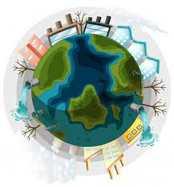

# **Data 690 - Data Visualization and Statistics**

- Name - Arthi Komma
- Campus id - GF89659

## **Project Part A**

## **Topic - "POPULATION GROWTH AND ITS IMPACT ON THE ENVIRONMENT"**

### **Introduction**

Population growth is the increase in the number of humans on Earth. For most of human history our population size was relatively stable. But with innovation and industrialization, energy, food, water, and medical care became more available and reliable. Consequently, global human population rapidly increased, and continues to do so, with dramatic impacts on global climate and ecosystems. Human overpopulation is one of the biggest causes of the depletion of natural resources. The world population has increased from 1 Billion in 1800 to 7.7 Billion in 2020. The global population is increasing. More people means more requirement and thus more usage of resources. At the current growth rate, it is expected that the global population will reach about 11 Billion until 2100.

Every time we use any natural resource, the Earth needs time to regenerate and replenish. But now we are using resources at speed faster than Earth can restore it. So, we are experiencing a shortage of funds. Did you know that about 700 million people in the world live in extreme poverty. Overpopulation is one of the root causes of environmental issues like climate change. More people not only means more need for resources but more carbon emission too. With so many people using natural resources, carbon emissions are skyrocketing. Climate change is accelerating, and the population is a significant reason why.

### **Analysis/Approach**

This report has analyzed the impact of population growth on the environment by collecting data and visualization chart from (http://www.worlddev.xyz/).

- **The topics used for the analyis are**
1. Economy & Growth
2. Health
3. Environment

- **The indiactors used for that analysis are**
1. GDP per capita, PPP (current international $) - This indicator provides per capita values for gross domestic product (GDP) expressed in current international dollars converted by purchasing power parity (PPP) conversion factor. GDP is the sum of gross value added by all resident producers in the country plus any product taxes and minus any subsidies not included in the value of the products.
2. Population, total - Total population is based on the de facto definition of population, which counts all residents regardless of legal status or citizenship. The values shown are midyear estimates.
3. Population growth (annual %) - Annual population growth rate for year t is the exponential rate of growth of midyear population from year t-1 to t, expressed as a percentage . Population is based on the de facto definition of population, which counts all residents regardless of legal status or citizenship.
4. Adjusted savings: mineral depletion (current US$)- Mineral depletion is the ratio of the value of the stock of mineral resources to the remaining reserve lifetime (capped at 25 years). It covers tin, gold, lead, zinc, iron, copper, nickel, silver, bauxite, and phosphate.
5. Adjusted savings: net forest depletion (current US$)- Net forest depletion is calculated as the product of unit resource rents and the excess of roundwood harvest over natural growth.
6. Adjusted savings: carbon dioxide damage (current US$) - Cost of damage due to carbon dioxide emissions from fossil fuel use and the manufacture of cement, estimated to be US$40 per ton of CO2 (the unit damage in 2017 US dollars for CO2 emitted in 2020) times the number of tons of CO2 emitted.
7. Adjusted savings: energy depletion (current US$) - Energy depletion is the ratio of the value of the stock of energy resources to the remaining reserve lifetime (capped at 25 years). It covers coal, crude oil, and natural gas.

- **The countries that are taken into consideration are**

1. United States
2. India
3. China
4. Japan
5. Germany
6. United Kingdom
7. Australia

- **The timeperiod included in the analysis is**
2016-2020

