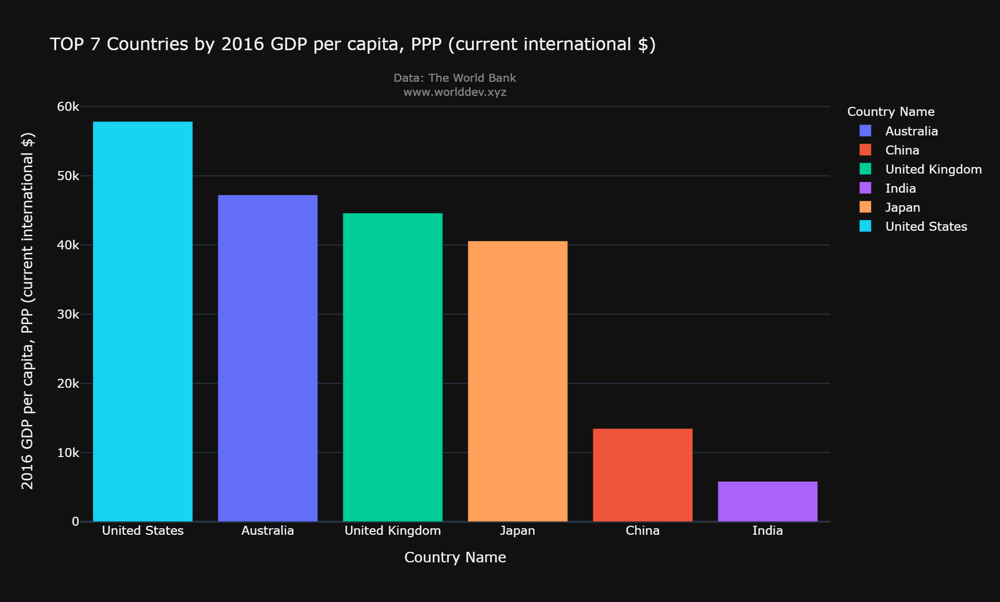
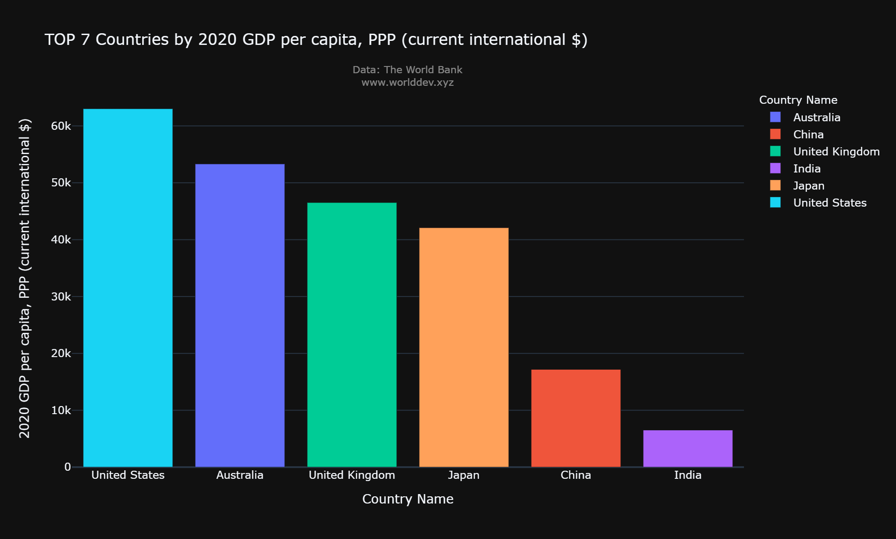
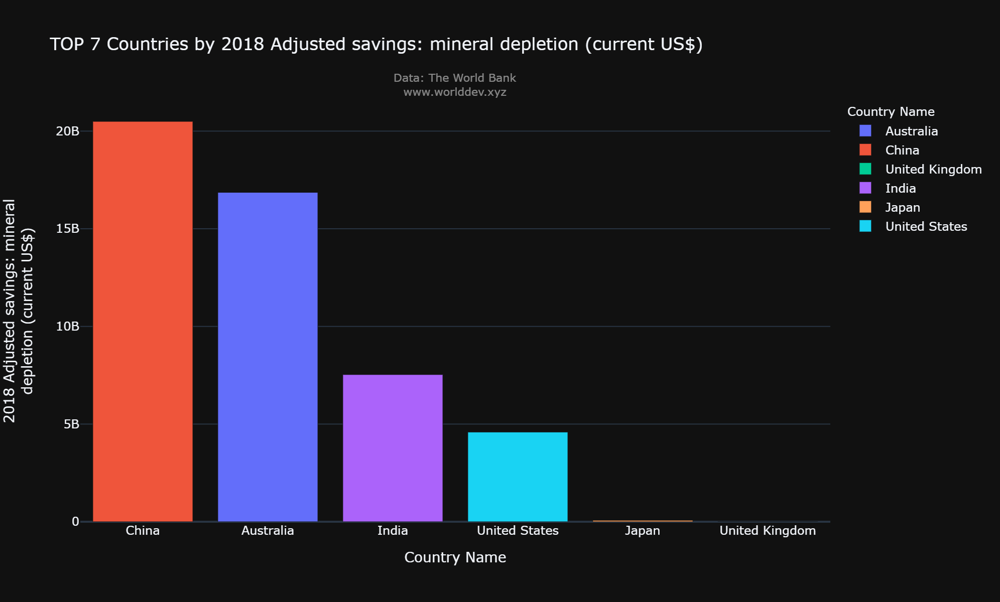
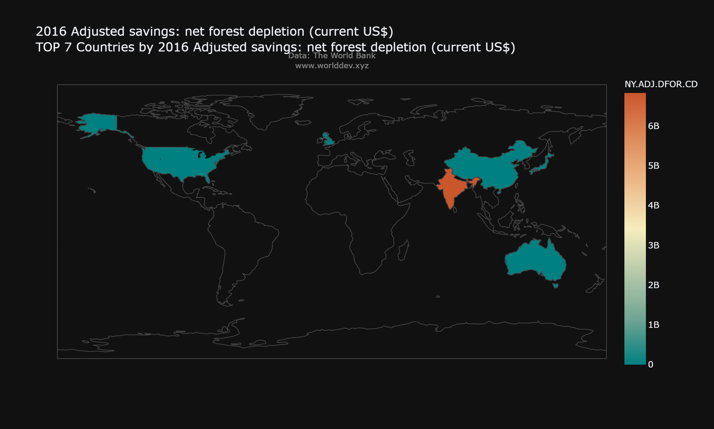
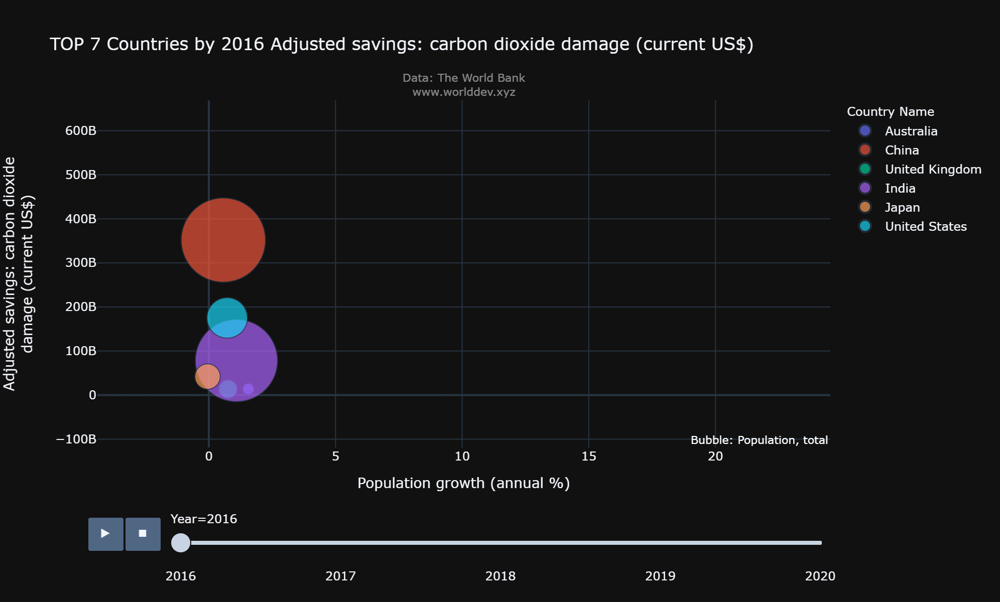
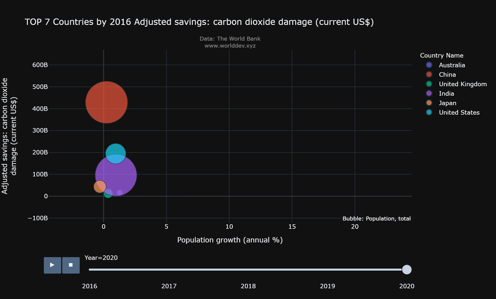

# **Data 690 - Data Visualization and Statistics**

- Name - Arthi Komma
- Campus id - GF89659

## **Project Part A**

## **Topic - "POPULATION GROWTH AND ITS IMPACT ON THE ENVIRONMENT"**

### **Introduction**

Population growth is the increase in the number of humans on Earth. For most of human history our population size was relatively stable. But with innovation and industrialization, energy, food, water, and medical care became more available and reliable. Consequently, global human population rapidly increased, and continues to do so, with dramatic impacts on global climate and ecosystems. Human overpopulation is one of the biggest causes of the depletion of natural resources. The world population has increased from 1 Billion in 1800 to 7.7 Billion in 2020. The global population is increasing. More people means more requirement and thus more usage of resources. At the current growth rate, it is expected that the global population will reach about 11 Billion until 2100.

Every time we use any natural resource, the Earth needs time to regenerate and replenish. But now we are using resources at speed faster than Earth can restore it. So, we are experiencing a shortage of funds. Did you know that about 700 million people in the world live in extreme poverty. Overpopulation is one of the root causes of environmental issues like climate change. More people not only means more need for resources but more carbon emission too. With so many people using natural resources, carbon emissions are skyrocketing. Climate change is accelerating, and the population is a significant reason why.

### **Analysis/Approach**

This report has analyzed the impact of population growth on the environment by collecting data and visualization chart from (http://www.worlddev.xyz/).

- **The topics used for the analyis are**
1. Economy & Growth
2. Health
3. Environment

- **The indiactors used for that analysis are**
1. GDP per capita, PPP (current international $) - This indicator provides per capita values for gross domestic product (GDP) expressed in current international dollars converted by purchasing power parity (PPP) conversion factor. GDP is the sum of gross value added by all resident producers in the country plus any product taxes and minus any subsidies not included in the value of the products.
2. Population, total - Total population is based on the de facto definition of population, which counts all residents regardless of legal status or citizenship. The values shown are midyear estimates.
3. Population growth (annual %) - Annual population growth rate for year t is the exponential rate of growth of midyear population from year t-1 to t, expressed as a percentage . Population is based on the de facto definition of population, which counts all residents regardless of legal status or citizenship.
4. Adjusted savings: mineral depletion (current US$)- Mineral depletion is the ratio of the value of the stock of mineral resources to the remaining reserve lifetime (capped at 25 years). It covers tin, gold, lead, zinc, iron, copper, nickel, silver, bauxite, and phosphate.
5. Adjusted savings: net forest depletion (current US$)- Net forest depletion is calculated as the product of unit resource rents and the excess of roundwood harvest over natural growth.
6. Adjusted savings: carbon dioxide damage (current US$) - Cost of damage due to carbon dioxide emissions from fossil fuel use and the manufacture of cement, estimated to be US$40 per ton of CO2 (the unit damage in 2017 US dollars for CO2 emitted in 2020) times the number of tons of CO2 emitted.
7. Adjusted savings: energy depletion (current US$) - Energy depletion is the ratio of the value of the stock of energy resources to the remaining reserve lifetime (capped at 25 years). It covers coal, crude oil, and natural gas.

- **The countries that are taken into consideration are**

1. United States
2. India
3. China
4. Japan
5. Germany
6. United Kingdom
7. Australia

- **The timeperiod included in the analysis is** 2016-2020

### **What is Population growth?**

Population growth is the increase in the number of people in a population or dispersed group. Global human population growth amounts to around 83 million annually, or 1.1% per year.The global population has grown from 1 billion in 1800 to 7.9 billion in 2020.

Over the last decade, global awareness of the human-nature relationship has grown, raising questions on the idea of economic prosperity at the expense of the environment. More individuals are questioning overpopulation which is also the result of climate change, increased carbon emissions, and biodiversity loss.

Economic growth is important as well as environmental safety since this is our planet and we have to be cautious to make it suitable to live in.
According to the New York Times, the United Nations announced that countries might either have "plans to reach net-zero CO2 emissions by 2050" or "a long-term national target." Others can pursue "a long-term strategy for climate-neutrality in accordance with the Paris Agreement," a 2015 worldwide agreement aimed at mitigating the worst effects of climate change.

### **Impact Of Population Growth on GDP per capita**

Population growth should lead to a continuation of global GDP growth, but the impact may be modest because growth in the working-age population is concentrated in countries with low labor productivity. The shape of the economic life cycle, with high consumption and low labor supply at older ages, will heighten the global economic costs of population aging. Current spending patterns suggest that the high costs will be absorbed by prime-age adults rather than children or the elderly. Many pressing environmental, health, and economic issues, some of which are considered here, are global in nature and inextricably linked to population. Understanding the connections is essential.

The above chart depicits the GDP per capita of various countries in the year 2016.

The above chart depicits the GDP per capita of various counytries in the year 2020.

By obeserving the above two charts we can say that the growth of GDP per capita is increasing at a constant pace from the year 2016 to 2020.

### **Negative impacts of Population Growth**
- **Mineral Depletion**

The total global population is more than seven billion people. Still, there is a consistent increase in the overall earth populace and this has been a critical factor in accelerating the depletion of natural resources. An increase in the populace expands the need for resources and conditions necessary to sustain it.
Even if everyone tried to adopt a correspondingly low material standard of living, with the population approaching eight billion, it would still cause the depletion of natural resources.
In addition, it contributes to increased ecological contamination. Research further indicates that developing countries are using more and more resources to industrialize and support their ever-increasing population. Hence, the depletion of natural resources will continue as long as the world population increases.

The above chart depcits the mineral depletion of various countries in the year 2018.
We can observe that the China and United States have more mineral depletion than other countries when compared. Whereas the United Kingdom shows no mineral depletion in the year 2018.

- **Energy Depletion**

When energy is scarce or expensive, people can suffer material deprivation and economic hardship. When it is obtained in ways that fail to minimize environmental and political costs, these too can threaten human wellbeing in fundamental and pervasive ways. The energy problem today combines these syndromes: much of the world's population has too little energy to meet basic human needs; the monetary costs of energy are rising nearly everywhere; the environmental impacts of energy supply are growing and already dominant contributors to local, regional, and global environmental problems (including air pollution, water pollution, ocean pollution, and climate change); and the sociopolitical risks of energy supply (above all the danger of conflict over oil and the links between nuclear energy and nuclear weapons) are growing too. This predicament has many causes, but predominant among them are the nearly 20-fold increase in world energy use since 1850 and the cumulative depletion of the most convenient oil and gas deposits that this growth has entailed, resulting in increasing resort to costlier and/or environmentally more disruptive energy sources.

The above chart depicits the energy depletion of various countries in the year 2018.
From the figure we can observe that the Japan has minimal percentage of energy depletion when compared to other countries.

- **Forest Area Depletion**

Being the heart and lungs of the world, forests act as barometers of the economy and environment (Kumar, 2001). The major factors contributing to deforestation are poverty, low level of income and population growth Debel et al.(2014). Since the dawn of human history, the destiny of humans and trees has remained tightly bound. Forests have exerted a tremendous influence on livelihood and economic development in many societies. One of the most important concerns of this age is the question of population growth and whether the earth’s resources can sustain this rapid expansion of population in most parts of the world. Forest clearing for agricultural encroachment and other land use systems affecting the natural forest of zaba kebele which is at its peak required an immediate management intervention in the area. Not only that many loads of fuel wood are deported and many quintals of charcoal are extracted daily. Ethiopia’s forests are being destroyed at an alarming rate and the area covered by forests at present is only 2.4% compared to the estimated 40% initial coverage. The primary causes of natural forest destruction are agricultural expansion and the demand for increasing amounts of construction materials, fuel wood and charcoal Million(2001).

The above figure depicits the forest area depletio of various countries in the year 2016.
From the figure we can observe that the India ranks first regarding to the forest area depletion than other countries. Due to the overpopulation in India more number of people are using the forest lands for vaious uses and hence depleting the  forest land.

- **Carbondioxide damage**

More people means more demand for oil, gas, coal and other fuels mined or drilled from below the Earth’s surface that, when burned, spew enough carbon dioxide (CO2) into the atmosphere to trap warm air inside like a greenhouse. According to the United Nations Population Fund, human population grew from 1.6 billion to 6.1 billion people during the course of the 20th century. (Think about it: It took all of time for population to reach 1.6 billion; then it shot to 6.1 billion over just 100 years.) During that time emissions of CO2, the leading greenhouse gas, grew 12-fold. And with worldwide population expected to surpass nine billion over the next 50 years, environmentalists and others are worried about the ability of the planet to withstand the added load of greenhouse gases entering the atmosphere and wreaking havoc on ecosystems down below.

Developed countries consume the lion’s share of fossil fuels. The United States, for example, contains just five percent of world population, yet contributes a quarter of total CO2 output. But while population growth is stagnant or dropping in most developed countries (except for the U.S., due to immigration), it is rising rapidly in quickly industrializing developing nations. According to the United Nations Population Fund, fast-growing developing countries (like China and India) will contribute more than half of global CO2 emissions by 2050, leading some to wonder if all of the efforts being made to curb U.S. emissions will be erased by other countries adoption of our long held over-consumptive ways.

The above figure depicits the carbon dioxide damage of various countries in the year 2016 and 2020.
From the figures we can observe that the carbon dioxide damage has a slight increase in all the countries other than India over the time period.

### **Conclusion**

From the analysis we can observe that with the increase in population over various countries has resulted in the depletion of renewable and non-renewable resources over a period of time. There would be no shock if these resources gets extinct by a century and the people belonging to various countries might face severe consequences in the mere future. The governments of all the countries in the world should find a way to control the overpopulation and make the resouces not to extinct.

### **References**
- Wang, C. (2021). The world development explorer. Available from http://www.worlddev.xyz
- https://storymaps.arcgis.com/stories/fc9006cfdb29418983264a6d23906940
- https://www.conserve-energy-future.com/causes-effects-solutions-depletion-natural-resources.php

